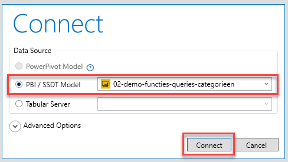

# Demo - DAX as Query Language

DAX is not only a definition language (used to define the definition of a column, measure or table in a formula), but it is also a *query language*. When you store data in a DAX data model (such as Analysis Services Tabular, Power Pivot or Power BI), this is also the way that front-end tools like Power BI use to communicate with the data model.

In this demonstration, you will get a short introduction by working with DAX Studio. DAX Studio is a free tool for executing DAX queries.

You can download the tool for free from [https://daxstudio.org](https://daxstudio.org/).

In this short demo, we will do three things:

* We open DAX Studio
* We query the Power BI DAX data model ourselves

0. Make sure the Power BI demo file from the previous demonstration is open.
1. Search for DAX Studio in the start menu. Start the program.
2. In the welcome screen, choose to connect to the Power BI model `04-demo-functions-queries-categories` and select **Connect**.



3. Execute the following query:

```dax
EVALUATE 'Customer'
```

The results of this query will appear at the bottom of the screen.

4. Modify the query as follows and view the results:

```dax
EVALUATE VALUES('Stock Item'[Color])
```

After the keyword **Evaluate**, you can enter any table expression that is possible in a DAX query. So, you can use all the examples from the previous demonstration where a *Calculated Table* was defined by DAX!

DAX Studio has many more features that can be very useful. Feel free to explore DAX Studio - you can't break anything!