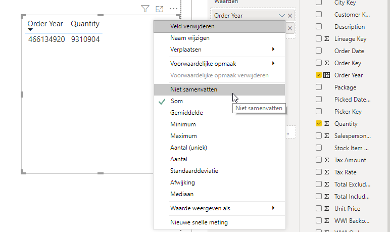
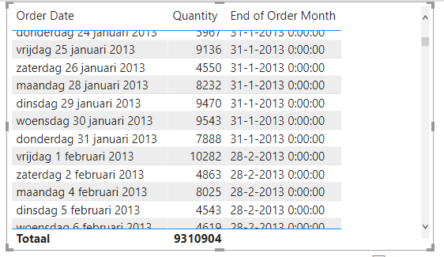
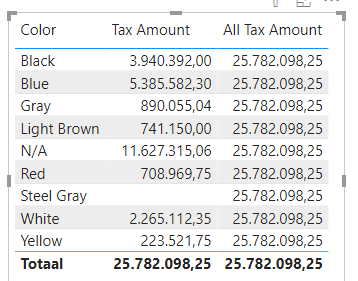
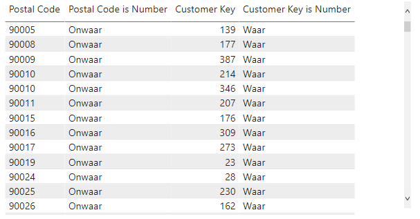
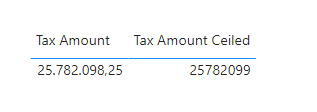

# Demo: Function Categories

> In this training, the demos are slightly different from what you're normally used to: instead of a trainer giving a demonstration, we have chosen to write out the demonstration, after which you will actually give the demonstration yourself. This way, some things will stick better, and there is less chance of missing something. An additional advantage is that you can easily refer back to the demonstration later to demonstrate or explain something.

## Preparation and Scope

In this demo, we will take a look at what DAX actually is. We will examine two things:

1. **Functions within DAX**. As explained earlier, DAX has eight different function categories. We will look at one or more examples of functions from each category.
2. **DAX as a query language**. We will be introduced to the tool **DAX Studio**, which allows us to "listen" to DAX queries from Power BI or Analysis Services, as well as write our own DAX queries.

A Power BI file is already available for us to work with in this demo - the file is called `04-demo-functions-queries-categories`. Open this file to get started with the demo.

## Examples of Functions

DAX has eight different function categories:

* DateTime
* Filter
* Information
* Logical
* Math and trigonometry
* ParentChild
* Statistical
* Text

To get a feel for this, we will look at two or three examples of functions from each category.

### DateTime
#### YEAR()

DateTime functions can help you process dates and times. For example, suppose you want to display the quantity of products sold per year.

1. From the **Order** table, select the **Order Date** field. Now, on your canvas, you will see a table with one column containing the dates on which the products were sold.
2. Drag the **Quantity** field from the **Order** table onto the list of dates.

The table now shows sales per day, but we want to see sales per *year*. To achieve this, we will add a **calculated column**.

3. In the **Fields** pane on the right side of your screen, select the **Order** table.
4. In the ribbon at the top, you will automatically be taken to the **Table Tools** tab. Here, you have the option to add a new column.
5. Click on **New column**. Below the ribbon, the DAX editor will appear, with the text `Column = ` displayed.
6. Replace this text with `Order Year = YEAR([Order Date])`.
7. Now, create a second table in which you place `Order Year` and `Quantity` side by side.
Power BI will by default try to sum every numerical value (unless you have indicated otherwise in the model). This includes `Order Year`. Fortunately, you can easily adjust this by selecting the table you just created and clicking on the arrow next to **Order Year** under the **Values** section. Now choose **Do Not Summarize**:



> In addition to the `YEAR` function, there are also several similar functions that extract months, days, and other date components. Here are a few examples:
> 
> * **DAY** returns the day number within a month (1-31)
> * **MONTH** returns the month number (1-12)
> * **YEAR** returns the year
>
> Similarly, you can use **QUARTER**, **WEEKDAY**, **HOUR**, **MINUTE**, and **SECOND**. There is also a **WEEKNUM** function, but be careful with the week numbering as it differs between Europe and the U.S.!)

#### DATEDIFF and EOMONTH

Now let's say we want to calculate the number of days remaining until the end of the month for each date. This requires two steps:
* We need to know when the end of the month is (which is not very straightforward in February).
* We need to calculate the number of days between a given date and the last date within the month.

Luckily, DAX has a built-in function to help us with the first problem. The **EOMONTH** function always tells us what the end of the month is.

8. Create a **New column** in the **Order** table. Give it the definition `End of Order Month = EOMONTH([Order Date], 0)`.
9. Add this column to the table where you had plotted `Order Date` against `Quantity` (i.e., the very first table).
10. You will now see the last day of the respective month for each displayed `Order Date`:



> As you can see, the EOMONTH function has two arguments: the date and a `0`. The second argument tells how many months ahead you want to look. This allows you to not only look at the last day of the current month but also the last day of the next month (`EOMONTH([Order Date], 1)`).

11. Create a **New column** in the **Order** table. Give it the definition `Days until end of Order Month = DATEDIFF([Order Date], [End of Order Month], DAY)`.
12. Add this column to the table where you just added `End of Order Month` as well.

13. Since `Days until end of Order Month` is again a numerical value, Power BI will try to aggregate it. Make sure this no longer happens.

14. Rearrange the columns so that `Quantity` is displayed as the last column.

You can now see for each order date how much was ordered, as well as how many days are left in the month.

### Filter

Filter functions are one of the more complex functions within Power BI. To keep the demonstration from getting too extensive (we will cover filters in depth later and even dedicate a whole module to them) here is a brief example. We want to analyze the paid tax per color of the product we sold:

15. Create a new tab, name it **Filter**.
16. Drag the field **Color** from the table **Stock Item** onto the canvas. 

On the canvas, a table with one column now appears. It lists the colors of the sold products.
17. Pull the **Tax Amount** field from the **Sale** table on top of the previously created table.

The table now shows how much tax is paid for each product color. To put it in technical terms, the **Sale** table is *filtered* for each color (Black, Blue, Gray, ...), and in the **Tax Amount** column, only the sum of the rows for that color is displayed.

We can remove the filters from a table using the **ALL** function:

18. In the **Fields** pane on the right side of your screen, select the **Sale** table.
19. In the ribbon at the top, you will automatically be taken to the **Table Tools** section. Here, you have the option to add a new measure.
20. Click on the **New Measure** button.
21. Replace the text `Measure =` with the DAX formula `All Tax Amount = CALCULATE(SUM([Tax Amount]), ALL('Order'))`.
22. Add the **All Tax Amount** column to the table along with the **Color** and **Tax Amount** columns.

You now have a table that shows the paid tax for each color on each row, as well as the total paid tax. The **ALL** function ensures that the "filter" for color is removed.


> As stated above, filter functions are the more complex functions within Power BI. At the same time, they are the key to truly powerful Power BI models and extensive measures. If you only roughly followed the above information, it's not a problem - we will go into more detail later.

### Information

The **information** category includes functions that can provide information about the contents of a column, or sometimes even about the system the customer is currently working with. An example is the **ISNUMBER** function:

23. Create a new tab and rename it to **Information & Logical**.
24. Drag the **Postal Code** column from the **Customer** table onto the canvas.

A table will appear with one column. In this column, you will find the values from the **Postal Code** field.

25. Click on the **Customer** table and create a new column. Give it the following DAX definition: `Postal Code is Number = ISNUMBER([Postal Code])`.
26. Drag the new **Postal Code Is Number** field onto the existing table.
You are now shown whether the values in the column **Postal Code** are numbers. *According to DAX, they are not!* The reason is that the numbers are stored as text here.

27. In the **Customer** table, create a second new column with the DAX definition `Customer Key is Number = ISNUMBER([Customer Key])`.
28. Drag both the **Customer Key** field and the **Customer Key is Number** field onto the table.



The **Customer Key** field is stored numerically and is also displayed as such by **ISNUMBER**. **ISNUMBER** now provides *information* about the *data type* of a column.

### Logical

The response to the **ISNUMBER** query we just made is either true or false. These responses are also referred to as "logical" answers. The category of functions that can work with this is called *logical* functions.

For this demonstration, we are doing a simple example: when the **Customer Key** column is numeric, we don't want to see the text **True**, but the text **This column is numeric** instead.
#### IF

29. Click on the name of the field **Customer Key Is Number** in the list of fields. (Be careful not to click on the checkbox - that will add a field to your report!)

The DAX editor opens with the function `Customer Key is Number = ISNUMBER([Customer Key])` inside.

30. Expand this function with an `IF` function so that the DAX definition of this column looks as follows: `Customer Key is Number = IF(ISNUMBER([Customer Key]), "This column is numeric", "This column is not numeric")`.
31. Now do the same for the column `Postal Code is Number`, so that the DAX definition is `Postal Code is Number = IF(ISNUMBER([Postal Code]), "This column is numeric", "This column is not numeric")`.

As you can see in the results, you can use **IF** to incorporate logic to make your report smarter, more beautiful, or function better.

### Math and trigonometry

The **Math and trigonometry** category includes various mathematical functions, including the helpful functions for rounding: `CEILING`.
32. Create a new tab named **Math & Trig**
33. Drag the **Tax Amount** field onto the canvas and change the visualization to a **table**
34. In the **Sale** table, create a new **measure** with the definition: `Tax Amount Ceiled = CEILING(SUM([Tax Amount]), 1)`
35. Drag this new measure onto the table to create a new column next to *Tax Amount*.



As you saw above, `CEILING` always rounds up. The second argument is the *multiple* to round up to. Try it out with the following values:

* 10
* 1000

### ParentChild

**ParentChild** functions are specifically designed for hierarchies in DAX. We haven't included a demo for this at the moment due to time constraints, as while not particularly complex, it is a separate topic that doesn't contribute greatly to understanding the rest of DAX.

### Statistical

Under the "statistical functions" heading, DAX doesn't just refer to statistics like **MAX**, **SUM**, **STDEV.P**, and **STDEV.S**. Functions that generate tables also fall into this category.

In the course, we won't go into great detail on this category of functions, but they are very useful! That's why we are highlighting three of them in this demo:

* CROSSJOIN
* SAMPLE

#### CROSSJOIN

36. Switch to the **Data view** in Power BI.
37. In the **Ribbon**, click on **New Table**.
38. Define this table as follows: `CrossJoin Example = VALUES('Stock Item'[Color])`. Look at the results.


The function **VALUES** we are using here is not a *statistical* function, but a *filter* function. It returns a table with only one column, containing unique values. In this case, there are only 9 unique values, while the underlying *stock item* table had 672 rows. This is useful when we continue with **CROSSJOIN**:

39. Change the table definition to `CrossJoin Example = CROSSJOIN(VALUES('Stock Item'[Color]), City)`

The **CROSSJOIN** function literally does what its name implies: it creates a "cross join" between two tables. For each row in the first table, all rows from the second table are added.

Since the first table is the *VALUES* expression (with 9 rows) and the second table is the complete City table (with 116,295 rows), this results in a total of **1,046,655 rows**! However, this is not a problem for a DAX data model: the table was filled within seconds.

Now save the file and look at the size - you will see that it is not a significant increase.

#### SAMPLE
40. Create a new table again. Give it the following DAX expression: `Sample-example = SAMPLE(1000, 'CrossJoin Example', [City])`

The `SAMPLE` function can take a sample from an existing table. This can help, for example, to test new calculations on a smaller set of data without having to access the (sometimes huge) underlying datasets.

### Text

The last function category is **Text**. Here you can easily work with texts. Most of these functions speak for themselves - in the demo, we use the **SUBSTITUTE** function to modify a text.

41. In the **data view** of Power BI, open the **City** table.

The **Sales Territory** column contains the values **Southeast** and **Southwest**. However, according to the company guidelines, this should be *South East* and *South West*. We are going to make this adjustment.

> Of course, you can solve this more structurally in an ETL and/or data quality step. However, you are fine-tuning a dashboard for a presentation now, and you prefer not to refresh the data.

42. Add a new column to the **City** table. Give it the following definition:
```DAX
Sales Territory Corrected = SUBSTITUTE([Sales Territory], "South", "South ")
```

## Eight or ten function categories?

Earlier, we stated that there are eight function categories in DAX. However, DAX actually distinguishes a ninth and even a tenth function category, which we will not discuss here. To give you an idea, we will include them here:

### Time-intelligence functions

Although these could technically fall under **Date & Time**, these functions are often a bit more complex. To provide a clear overview, the documentation has chosen to separate them. This way, users who come across the date function `EOMONTH` will not be confused with the "time intelligence" function `ENDOFMONTH`.

The Time Intelligence functions go into too much depth for now - we will certainly cover them later in the course!

### Other functions

DAX has one final category: "other functions". This category includes some very useful functions. Try adding the following functions as a **calculated table**:

* **GENERATESERIES** returns a table with one column containing ascending numbers:

```dax
Generate Series example = GENERATESERIES(1, 5000)
```

* DAX has an inline **table constructor** that makes it very easy to manually populate a new table:

```dax
Table constructor example = {1, 2, 3}
```

