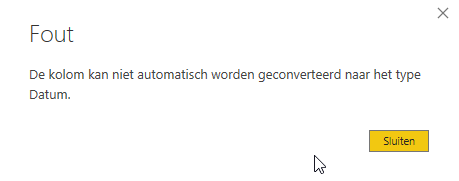

# Datatypes

In dit *mini-lab* gaan we aan de slag met datatypes in DAX. We hebben daarvoor een bestand uitgekozen waarin bewust alle datatypes op *tekst* staan. Daar gaan we wat aan veranderen in het datamodel.

## Video

Bekijk eerst onderstaande video. Hierin krijg je een kort overzicht van de verschillende datatypes die er in DAX aanwezig zijn, en hoe je hiermee kunt omgaan.

<iframe width="560" height="315" src="https://www.youtube.com/embed/_pxvvhDuOVA" frameborder="0" allow="accelerometer; autoplay; encrypted-media; gyroscope; picture-in-picture" allowfullscreen></iframe>

## Getallen versus tekst - de opslag

0. Bekijk het Power BI-bestand `11-datatypes-minilab` met Windows Verkenner. Merk op dat het bestand nu 5,89 MB is (6.042 kB)
1. Open het Power BI-bestand `11-datatypes-minilab`
2. Schakel naar de **Gegevens** weergave binnen Power BI
3. Selecteer de kolom **Order Key**
4. Stel het **Gegevenstype** in op **Geheel getal**. Bevestig dat je dit echt wilt doen.
5. Sla het bestand opnieuw op, en bekijk het formaat van het bestand met Windows Verkenner. Merk op dat het bestand nu bijna 10% kleiner is geworden - ca. 5,27 MB (5.402 kB)

Verander ook de volgende kolommen in **Geheel getal**:

* City Key
* Customer Key
* Stock Item Key
* Salesperson Key
* Picker Key
* WWI Order ID
* WWI Backorder ID
* Quantity

Wanneer je het bestand nu bekijkt met Verkenner, zie je dat het weliswaar iets kleiner geworden is, maar niet heel veel (ca. 5,21 MB / 5.346 kB). De reden hiervoor is tweeledig:

* Getallen nemen (over het algemeen) minder ruimte in dan tekst. Daarom worden de bestanden telkens kleiner
* Power BI slaat data per kolom op. We kijken later naar wat dat precies betekent, maar één tipje van de sluier kunnen we wel vast oplichten: als waarden meerdere keren voorkomen, nemen ze niet twee keer zoveel ruimte in.

**Order Key** was een kolom met 231.412 unieke waarden - als je dan van tekst- naar getallen-opslag gaat, tikt dat dus extra hard aan.

## Datums en tijden

6. Stel nu de kolom **Order Date** in op het datatype **Datum**. Merk op dat je ook een indeling kunt kiezen - kies hier 'dd-mm-yy' (14-03-01).
7. Probeer nu de kolom **Picked Date Key** in te stellen op **Datum**. Je krijgt de volgende foutmelding:



De reden dat dit niet lukt, is dat er een **lege tekstwaarde** in de kolom aanwezig is. En hoewel een "echte" ontbrekende waarde (`BLANK` in Power BI) geen probleem is (die bestaat ook in een datumkolom), is een lege tekst een ongeldige datum.

8. Hernoem de kolom **Picked Date Key** naar **Picked Date Key SOURCE**
9. Maak een nieuwe kolom **Picked Date Key** met de volgende definitie:

```dax
Picked Date Key = IF([Picked Date Key SOURCE] = ""; BLANK(); [Picked Date Key SOURCE])
```

10. Probeer nu deze nieuwe kolom **Picked Date Key** in te stellen op datatype **datum**. Verberg de oude kolom voor de rapportageweergave.

## Decimale getallen

11. Stel de kolom **Unit Price** in op het datatype **Vast Decimaal getal**. Kies voor een indeling **Valuta**, met twee cijfers achter de komma.

> Als stap 11 niet lukt, komt dit doordat er een punt gebruikt wordt als decimaal scheidingsteken (dus er staat 13.00, maar volgens een Nederlandse Windows-installatie moet dat 13**,**00 zijn). Volg hiervoor hetzelfde patroon als hierboven:
>
> * Hernoem de kolom **Unit Price** naar **Unit Price SOURCE**
> * Maak een nieuwe kolom **Unit Price**
> * Gebruik de DAX-functie **SUBSTITUTE** om de punt te vervangen door een komma
> * Probeer nu de nieuwe kolom op te slaan als **Vast decimaal getal**
> * **Verberg** de kolom **Unit Price SOURCE**
>

## Terugblik

We hebben zojuist enkele aanpassingen in ons datamodel gemaakt met betrekking tot datatypes. De meeste aanpassingen aan datatypes doe je echter gedurende het inladen van data - niet in je DAX datamodel. Dat kan bijvoorbeeld in het ETL-proces van je Data Warehouse, of in een Power Query-definitie binnen Power BI of Analysis Services. Het is daar veel eenvoudiger om lege waarden weg te laten, punten door komma's te vervangen en rekening te houden met regionale instellingen van een bronbestand. En je hoeft de "onderliggende" kolommen (waar we nu **SOURCE** achter gezet hebben) niet mee te nemen in je model. Daarmee blijft je model overzichtelijker, kleiner en sneller.
