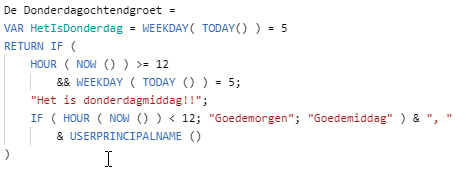
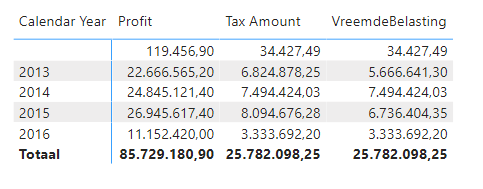

# Variables

## Voorbereiding

Open het Power BI-bestand `21-variables`. Hierin bevindt zich een variant op de "Donderdagochtendgroet" measure die je eerder ontwikkeld hebt (functioneel is hij hetzelfde, alleen zit nu alle logica in één measure verwerkt).

## Variabelen voor overzicht

De `Donderdagochtendgroet` measure is momenteel één grote measure. Dit is vaker het resultaat wanneer je intensief bezig bent met een stukje DAX: op het moment dat je ermee bezig bent zitten alle nuances in je hoofd, maar wanneer je later terugkijkt is de code opeens wat complexer dan je jezelf herinnerde.

```dax
De Donderdagochtendgroet = IF(HOUR(NOW()) >= 12 && WEEKDAY(TODAY()) = 5, "Het is donderdagmiddag!!", IF(HOUR(NOW()) < 12, "Goedemorgen", "Goedemiddag") & ", " & USERPRINCIPALNAME())
```

Als eerste stap gaan we de measure wat structuur geven.

1. **Kopieer de definitie** van de measure
2. Open een webbrowser, en **navigeer naar [https://www.daxformatter.com/](https://www.daxformatter.com/)**.
3. **Plak** de measure **in het grijze vlak** bovenaan de website
4. Klik op **Format**
5. Klik op **Copy**
6. Vervang de **donderdagochtendgroet** measure binnen Power BI door de - nu iets netter opgemaakte - measuretekst van DAX Formatter.

We gaan nu variabelen toevoegen om de measure nog duidelijker te maken. Eigenlijk zijn er twee stukjes logica die eenvoudiger zouden kunnen:

* Er wordt gecontroleerd of het ochtend is d.m.v. `HOUR ( NOW() ) < 12`
* Er wordt gecontroleerd of het donderdag is d.m.v. `WEEKDAY ( TODAY () ) = 5`

7. Voeg binnen Power BI in de measure-definitie direct na de teekst `De Donderdagochtendgroet =` een nieuwe regel toe met **shift+enter**
8. Zet op deze regel de tekst `VAR HetIsDonderdag = WEEKDAY ( TODAY () ) = 5`
9. Zet op regel drie (direct voor de `IF`) de tekst `RETURN `

De measure ziet er nu als volgt uit:



10. Controleer of de measure nog steeds werkt.
11. Vervang op regel 5 nu de DAX-expressie `WEEKDAY ( TODAY () ) = 5` door de variabele `HetIsDonderdag`
12. Voeg nu ook een variabele toe `HetIsOchtend`, en laat deze de definitie `HOUR ( NOW () ) < 12` vervangen.
13. Doe dit nu ook met een variabele `HetIsMiddag` - deze vervangt de definitie `HOUR ( NOW () ) >= 12`
14. Test of je measure nog steeds werkt, en laat deze door DAX Formatter nog even opmaken

Je measure ziet er nu als volgt uit:

```dax
De Donderdagochtendgroet =
VAR HetIsDonderdag =
    WEEKDAY ( TODAY () ) = 5
VAR HetIsOchtend =
    HOUR ( NOW () ) < 12
VAR HetIsMiddag =
    HOUR ( NOW () ) >= 12
RETURN
    IF (
        HetIsMiddag && HetIsDonderdag,
        "Het is donderdagmiddag!!",
        IF ( HetIsOchtend, "Goedemorgen", "Goedemiddag" ) & ", "
            & USERPRINCIPALNAME ()
    )
```

15. Zijn er nog meer verbeteringen door te voeren die de measure beter leesbaar of eenvoudiger zouden maken?

## Zelf aan de slag met variabelen

Probeer nu de volgende opdrachten uit te voeren met behulp van variabelen en het VAR-keyword

16. Maak een nieuwe *measure* met de naam `TweePlusTweeMeasure`
    * Zorg dat zich in de measure een variabele met de naam `Twee`  bevindt, en de waarde `2`
    * Het resultaat van de measure moet het optellen van deze  variabele met zichzelf zijn
    * Voeg een kolomdiagram toe waarin je deze measure uitzet tegen *Calendar Year*. Controleer of de resultaten kloppen met wat je zou verwachten.
17. Maak nu een *calculated column* aan met de naam `TweePlusTweeColumn`, in de tabel `Dimension Date`. Geef deze dezelfde definitie als `TweePlusTweeMeasure`.
    * Maak ook hier een kolomdiagram aan waarin je deze *Calculated  Column* uitzet tegen *Calendar Year*. Vergelijk de resultaten van  de vorige opdracht en deze en verklaar wat er achter de schermen  gebeurt:
      * Waarom krijg je de getallen die je ziet?
      * Wat rekent Power BI achter de schermen uit?
      * Komt het getal je bekend voor?
      * Wat gebeurt er als je de manier van aggregeren verandert naar bijv. een som? Kun je de getallen dan nog steeds verklaren?
18. Maak een *measure* aan met de naam `VreemdeBelasting`.
    * Voor de even jaren neem je de **SUM** van `'Fact Sale'[Tax Amount]`
    * Voor de oneven jaren neem je 25% over de **SUM** van `'Fact Sale'[Profit]`
    * Je bepaalt of een jaar even is met de functie `ISEVEN`
    * Gebruik variabelen om deelberekeningen op te slaan
    * Binnen een *measure* kun je niet direct de waarde van één jaar gebruiken. Om dit op te lossen, sla je als eerste stap het huidige geselecteerde jaar op in een variabele. Dit doe je met de definitie `VAR GeselecteerdJaar = MAX('Dimension Date'[Calendar Year])`. Gebruik deze variabele wanneer je het huidige jaar wilt weten of vergelijken.
    * Zorg ervoor dat de measure de tabel **Fact Sale** als *home table* (starttabel) heeft.
    * Controleer je resultaten met een matrix-visual. Hieronder zie je de correcte uitkomst.

