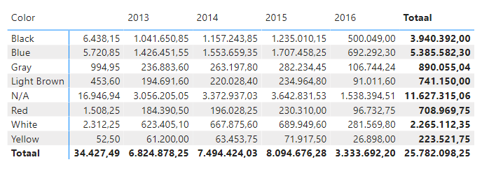
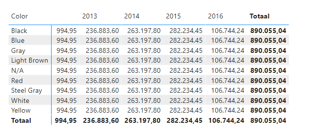
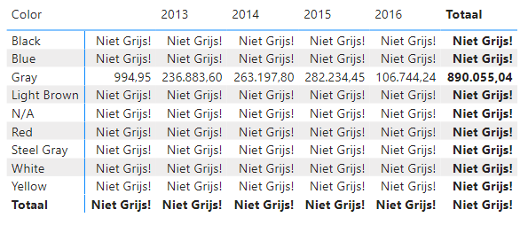
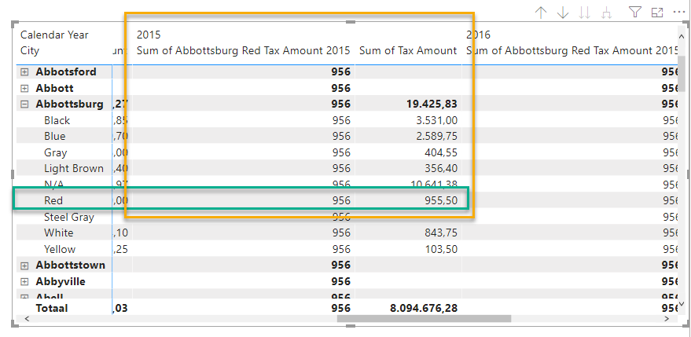
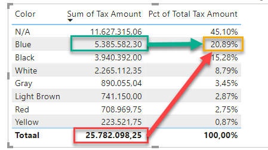
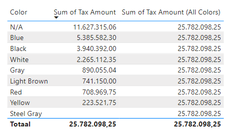

# Context - lab 1

Context is by far the most important thing you're going to learn in this course. That's why this lab is a bit bigger. We have divided it into three "levels" - and we recommend working through it from easy to advanced. Of course, you can rewatch the instructional videos if something is not quite clear.

Context is also a complex topic. If something is not clear, please don't hesitate to ask!

## Preparation

Open the Power BI file `33-filter-context-lab-groot`.

## Simple context exercises

1. Create a simple measure `Sum of Tax Amount`. It should calculate the sum of the paid tax based on the column `'Fact Sale'[Tax Amount]`
   * We don't change anything explicitly in the context here
   * Verify with a matrix if the measure breaks down by `'Dimension Date'[Calendar Year]` (columns) and `'Dimension Stock Item'[Color]` (rows)

2. Create a variation of this measure called `Sum of Gray Tax Amount`. This measure should calculate the sum of tax paid for gray products, regardless of the color specified in the rows.
   * You can adjust the filter context using the `CALCULATE` function.
   * If you need a reminder, in the video there was an example of this measure that did the same thing for *red* products and *quantity*.

3. Create a third variation of this measure called `Sum of Only Gray Tax Amount`. When the product color in the filter context is not "Gray", the text "Not Gray!" should be displayed.
   * Use the `SELECTEDVALUE` function to determine the selected value in the filter context.
   * Use the `IF` function to make a choice.
   * You don't need to repeat all the `CALCULATE` code for the gray products - you can refer to your previously created measure `[Sum of Gray Tax Amount]`.

4. Create a new measure called `Sum of Abbottsburg Tax Amount`. This measure should display the tax paid for the `'Dimension City'[City]` **Abbottsburg**.
5. Expand this measure:
   * Rename it to `Sum of Abbottsburg Red Tax Amount`.
   * Apply a filter for Abbottsburg and `'Dimension Stock Item'[Color]` **Red**.
   * You can easily add the new filter context adjustment to your `CALCULATE` statement: `CALCULATE(SUM('Fact Sale'[Tax Amount]), filter adjustment1, filter adjustment2, filter adjustment3, etc.)`.
6. Expand this measure one more time:
   * Rename it to `Sum of Abbottsburg Red Tax Amount 2015`
   * Filter on `'Dimension Date'[Calendar Year]` **2015** in addition to Abbottsburg and Red
   * Test the measure by placing the two new *measures* side by side in a matrix. Keep in mind that the display settings of your measure may introduce rounding differences (adjust if necessary to verify everything is working correctly):  

## Combining inner and outer context

We will now combine exercises involving inner and outer context. One example of this is calculating **percentage of total**:

To calculate the percentage of blue sales as a share of the total, the amount **within the filter context** (in the image above, it is `5,385,582.30` outlined in green) needs to be divided by a number **without the filter applied** (the amount `25,782,098.25` outlined in red). Fortunately, this is not too difficult in DAX. Let's take it step by step:

7. Create a new measure with the definition `Sum of Tax Amount (All Colors) = SUM('Fact Sale'[Tax Amount])`
8. Now, change the filter context using `CALCULATE`.
   * Previously, we replaced filters. This was done by using an expression like `'Dimension Stock Item'[Color] = "Red"`.
   * Now, we are going to remove the filter. We will use the `ALL()` function for this.
   * `ALL()` can remove filters from either a single column or an entire table.
   * For now, we choose to specifically remove the filter from the column `'Dimension Stock Item'[Color]`.
   * This can be done with the expression `ALL('Dimension Stock Item'[Color])`.
9. Verify the functionality of your new measure by including the following three fields in a table:
   * `'Dimension Stock Item'[Color]`
   * `Sum of Tax Amount`
   * `Sum of Tax Amount (All Colors)`  

10. Now create the measure `Pct of Tax Amount (All Colors)` by dividing `Sum of Tax Amount` by `Sum of Tax Amount (All Colors)`.
    * Use the `DIVIDE` function for the division (find documentation about Divide [here](https://dax.guide/divide/)).
11. Combine all the code into the measure `Pct of Tax Amount (All Colors)`. Use variables to store intermediate results.
12. Now create a measure `Sum of Tax Amount (All StockItems)`.
* This one resembles `Sum of Tax Amount (All Colors)`, but it removes all filters from `'Dimension Stock Item'`, not just `'Dimension Stock Item'[Color]`.
* Test the measures by placing them in a table side by side. See what the impact is on both measures when a slicer on another column in `Dimension Stock Item` (not `Color`) is applied.
* Now also test with a slicer on another table. Are the results as expected?

13. Now create the following (somewhat strange) measure with the name `strange quantity measure`:
   * We are looking at the quantity of sold products: `'Fact Sale'[Quantity]`.
   * When the numbers we are looking at pertain to **blue** products, the filter from `'Dimension Date'[Calendar Year]` should be removed. The blue products should always show the numbers for all years.
   * When the numbers we are looking at pertain to **gray** products, the numbers for **red** products should be shown.
   * In all other cases, the filter context is left intact.
   * Make use of the knowledge you have acquired so far on:
     * `IF` (and nested IF statements)
     * `SELECTEDVALUE`
     * `CALCULATE` in combination with `ALL`
     * `VAR` (**this allows you to "test" one of the conditions mentioned above separately!**)

14. Create a new measure named *Sum of Profit in All Cities*
    * Ensure that this measure shows the profit in all cities (i.e., remove the filter currently applied on Dimension City)
      * Verify if it works as expected by displaying the column next to the existing *Profit* column. How do you know if you have calculated the correct number?
      * Add a new slicer based on *Country*. Does the measure still work as expected?
      * Suppose you now want to see all cities only but keep the filter on *Country*. How do you solve this?
      * Conversely, if you want to ignore filters on any column that can be filtered in *Dimension City*?
15. Create a new measure *Percentage of Total Profit*, where the current profit (in a city) is divided by the total profit. Use the `DIVIDE` function. Ensure that this is displayed as a percentage.
16. Create a new measure *Y-Profits*.
    * When the selected city starts with a **Y**, show the profit.
    * Otherwise, return `BLANK()`.
    * Use the `MAX()` function to retrieve the current city. Save the value in a `VAR`.
    * Use the `LEFT` function to determine the first character of the city name.
    * Examine the result.
      * Is it as expected?
      * Explain the value of the **total** row.
## Advanced / bonus assignment

Not satisfied with the filter context yet? We have an extra assignment for you. Don't worry if you can't solve it - we will revisit it later in the course!

In this bonus assignment, we want to create a Year-to-Date measure using only three DAX functions:

* `CALCULATE`
* `SUM`
* `ALL`
* `MAX`
* You can also use the `YEAR` function, but it's not required.

Additionally, we'll use DAX language elements as variables (`VAR` .. `RETURN`) and various logical operators.

The goal is to achieve the following functionality:

In the above image, the ProfitYTD on January 4th is the sum of profits on January 1st, 2nd, 3rd, and 4th. In other words, *all dates up to and including today within the current year*. In a line chart, you can see the progression of YTD throughout the year - it resets to zero at the beginning of each year:

Now, use your knowledge from earlier to build the YTD using the functions mentioned above. Before you start, here's one tip that will definitely help you:

**In a CALCULATE, all modifications to the filter context are applied from left to right. So, you can first remove all filters on a table using `ALL('myTable')`, and then reapply filters within the same table using `'myTable'[MyColumn] = "NewFilteredValue"`.**

You can also find useful tips in the previous labs and demos. In particular, the lab from module 2 might be helpful if you get stuck.

Again, don't worry if you can't solve this - feel free to ask for assistance. We will definitely revisit this later in the course!
