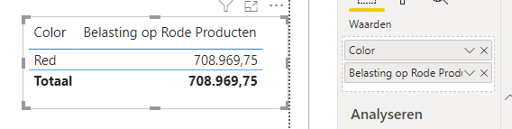
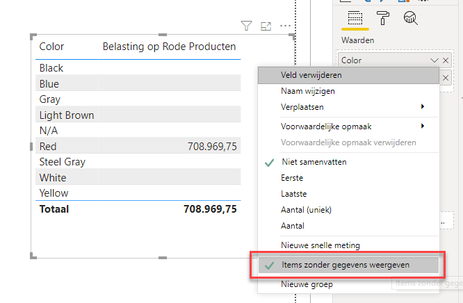
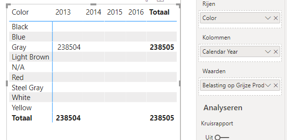

# Filtering - minilab 1

Open the file `51-filtering-minilab1.pbix`.

1. Create a calculated table named `Rode Producten` (Red Products). Use DAX to ensure that it only contains red products from the `Dimension Stock Item` table.
   * Check the results in Power BI's data view.
2. In the `Fact Sale` table, create a calculated measure named `Belasting op Rode Producten` (Tax on Red Products). Make sure to calculate the sum of `'Fact Sale'[Tax Amount]`, but only for red products.
   * When you disable the `'Dimension Stock Item'[Color]` column against the new measure `[Belasting op Rode Producten]`, only the color *Red* should be displayed:  

   * When you select "Items without data" for the `[Color]` column, you'll see that the other colors have no value:  

3. Now, create a calculated measure named `Belasting op Grijze Producten in 2013` (Tax on Gray Products in 2013) in the `Fact Sale` table.
   * Use a **matrix** and the **Items without data** functionality to verify the results.  

