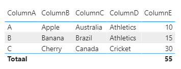
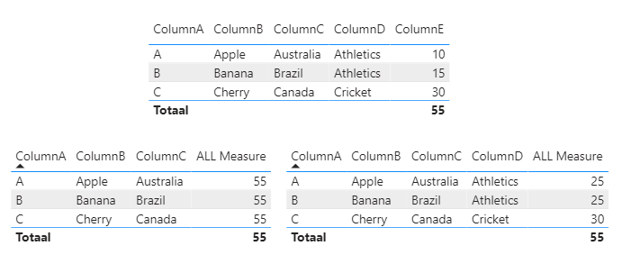
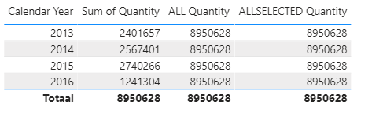
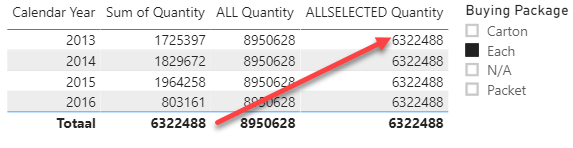

# Demo - ALL, ALLEXCEPT en ALLSELECTED

In deze "self-paced" demo verkennen we verschillende smaken van de `ALL` operator.
We doen dit met een eenvoudige tabel, die je zowel hieronder vindt als in het Power BI-bestand `53-guided-demo-allexcept-allselected.pbix`.

| ColumnA | ColumnB | ColumnC   | ColumnD   | ColumnE |
|---------|---------|-----------|-----------|---------|
| A       | Apple   | Australia | Athletics | 10      |
| B       | Banana  | Brazil    | Athletics | 15      |
| C       | Cherry  | Canada    | Cricket   | 30      |

## Voorbereiding

Open het bestand `53-guided-demo-allexcept-allselected`.

## ALL

De functie `ALL` hebben we eerder al gebruikt. Met wat we zojuist geleerd hebben over filters en de `FILTER`-functie kijken we hier opnieuw naar. Daarnaast gebruiken we onze kennis die we al over de `ALL` functie hebben om een measure te maken die we goed kunnen vergelijken met `ALLEXCEPT` en `ALLSELECTED`.

1. Maak een tabel aan waarin je alle kolommen van *Table1* naast elkaar zet  

2. Open [DAX Formatter](https://www.daxformatter.com/) en laat de volgende measure-definitie netjes opmaken:  
`ALL Measure = CALCULATE(SUM(Table1[ColumnE]), ALL(Table1[ColumnA], Table1[ColumnB], Table1[ColumnC]))`
3. Voer de - nu netjes opgemaakte - measuredefinitie in binnen het Power BI model.
4. Maak een **Table visualisatie** waarin je de volgende velden neerzet:
   * **ColumnA**
   * **ColumnB**
   * **ColumnC**
   * **ALL Measure**
5. **Kopieer en plak** de table visualisatie. **Voeg ColumnD toe**. Als het goed is staan er nu de volgende velden in de tweede table-visualisatie:
   * **ColumnA**
   * **ColumnB**
   * **ColumnC**
   * **ColumnD**
   * **ALL Measure**
6. Vergelijk de drie tabellen (de tabel met brondata vs. de twee tabellen met een `ALL` measure. Is het resultaat wat je verwachtte?  

> ### Hoe ziet de filter context eruit?
>
> Ook wanneer je de bovenstaande tabellen volledig logisch vindt, is het nog steeds nuttig om expliciet te benoemen wat hier gebeurt.
> `ALL` zorgde er hier voor dat de filters van de kolommen A t/m C verwijderd werden, maar D bleef staan. Dat zorgt voor de volgende uitkomsten:
>
> * Op de afbeelding hierboven de tabel **linksonder** bevat kolommen *ColumnA*, *ColumnB* en *ColumnC*. Anders gezegd: de filter context bestaat voor de eerste rij uit:
>   * ColumnA = "A"
>   * ColumnB = "Apple"
>   * ColumnC = "Australia"
> * Dit zijn exact de kolommen waarvan `ALL Measure` de filter verwijdert met de functie `ALL`. **`ALL` doet wat dat betreft dus exact het omgekeerde van `FILTER`: `FILTER` voegt filters toe, `ALL` verwijdert ze.**
> * Op de afbeelding hierboven de tabel **rechtsonder** bevat ook nog de kolom *ColumnD*. De `ALL measure` verwijdert hier geen filters van, dus die blijven intact.
>   * **Hoewel de tabel drie rijen kent, bestaat de filter context voor de `SUM` functie binnen `ALL Measure` nog maar uit één filter: de filter op `ColumnD`**
>   * Op regel 1 bestaat de filter context voor `SUM` uit één filter: `ColumnD = "Athletics"`
>     * Alle waarden waar dat geldt worden opgeteld: 10 + 15 = 25
>   * Op regel 2 gebeurt hetzelfde als op regel 1
>   * Op regel 3 bestaat de filter context voor `SUM` ook uit één filter: `ColumnD = "Cricket"`
>     * Er is maar één waarde voor Cricket: 30
>   * Op regel 4 (*Totaal*) is de filter context voor `SUM` leeg
>     * Er ligt in de totaalregel geen filter op `ColumnD` (en ook niet op de andere kolommen)
>     * Alle waarden in kolom `Table1[ColumnE]` worden dus opgeteld: 10 + 15 + 30 = 55

## ALLEXCEPT

De functie **ALL** verwijdert alle impliciete filters van de kolommen die je expliciet benoemt: `ALL(Table1[ColumnA])` verwijdert alle impliciete filters van `Table1[ColumnA]`. De functie **ALLEXCEPT** verwijdert juist de filters van kolommen die je *niet* expliciet benoemt. Je moet daarom wel zowel een tabel als minimaal één kolom benoemen.

7. Maak een nieuwe measure `ALLEXCEPT measure` met de volgende definitie:
   * `ALLEXCEPT Measure = CALCULATE ( SUM ( 'Table1'[ColumnE] ), ALLEXCEPT ( Table1, Table1[ColumnD] ) )`
8. Voeg de nieuwe measure toe aan de twee tabellen (zowel de tabel zónder, als de tabel mét ColumnD). Zoals je ziet functioneren deze exact hetzelfde.

`ALLEXCEPT` is strikt gezien een overbodige functie: alles wat je met `ALLEXCEPT` doet, kun je ook met `ALL`. Het maakt de leesbaarheid van je calculated measure echter een stuk beter.

## ALLSELECTED

De functie **ALL** verwijdert alle impliciete filters - feitelijk maakt deze dus rijen beschikbaar die je anders niet had kunnen zien. Zoals je eerder hebt kunnen zien, helpt dit bijvoorbeeld om percentages van het geheel weer te geven.

De functie **ALLSELECTED** doet dit ook - maar met één groot verschil: **`ALLSELECTED` verwijdert alleen de impliciete filters die __binnen__ de query actief zijn.**. We gaan direct verkennen hoe dat eruit ziet:

9. Maak in de tabel `'Fact Sale'` drie nieuwe measures aan:
   * `Sum of Quantity = SUM('Fact Sale'[Quantity])`
   * `ALL Quantity = CALCULATE( SUM('Fact Sale'[Quantity]), ALL('Fact Sale') )`
   * `ALLSELECTED Quantity = CALCULATE( SUM('Fact Sale'[Quantity]), ALLSELECTED('Fact Sale') )`
10. Maak een tabelvisualisatie met daarin zowel het veld `'Dimension Date'[Calendar Year]` als de zojuist aangemaakte drie measures:

Zoals je ziet, reageren de drie measures als volgt op de uitspliting per `'Dimension Date'[Calendar Year]`:

* `Sum of Quantity` laat de filtercontext intact: op rij 1 worden daarom alleen de waarden uit `[Quantity]` weergegeven waar `'Dimension Date'[Calendar Year] = 2013`
  * `'Dimension Date'[Calendar Year]` filtert alle rijen in `'Dimension Date'`. Ook de kolom `'Dimension Date'[Date]` is dus gefilterd.
  * `'Dimension Date'[Date]` heeft een relatie met `'Fact Sale'[Invoice Date Key]`.
  * Door de relatie tussen `'Dimension Date'` en `'Fact Sale'` worden de rijen van `'Fact Sale'` uitgefilterd.
  * Hierdoor is de `SUM('Fact Sale'[Quantity])` dus anders voor 2013 dan voor 2014
* `ALL Quantity` verwijdert alle impliciete filters uit de filtercontext. Op alle rijen wordt daar om het totaal van 8950628 weergegeven: er zitten geen filters meer in de filtercontext.
* `ALLSELECTED Quantity` doet in dit voorbeeld hetzelfde als `ALL Quantity`.

Op het eerste gezicht is er geen verschil tussen `ALL` en `ALLSELECTED`. Dat heeft een reden: **de measures waar we nu naar kijken, hebben in hun filter context alleen maar filters die afkomstig zijn uit de eigen query**. Vrij vertaald voor Power BI: alle filtering vindt plaats vanuit de eigen *visual*.

11. Voeg aan het rapport nu een *slicer* toe op de kolom `'Dimension Stock Item'[Buying Package]`. Selecteer de waarde **each**.
    * Je ziet dat `ALL Quantity` measure ongewijzigd blijft. Dat is logisch: *alle* impliciete filters worden verwijderd.
    * `ALLSELECTED Quantity` behoudt echter wel een filter: de filter `'Dimension Stock Item'[Buying Package] = "Each"`.

Je ziet nu dat alledrie de measures verschillend reageren:

* `Sum of Quantity` laat de filtercontext intact: op rij 1 worden daarom alleen de waarden uit `[Quantity]` weergegeven waar `'Dimension Date'[Calendar Year] = 2013` en waar `'Dimension Stock Item'[Buying Package] = "Each"`
* `ALL Quantity` verwijdert alle impliciete filters uit de filtercontext. Hoewel we dus een externe filter hebben toegevoegd (de slicer op `'Dimension Stock Item'[Buying Package]`), wordt deze even vrolijk weer verwijderd door de `ALL` functie
* `ALLSELECTED` verwijdert alleen de filters **binnen de query** (voor Power BI: **binnen de *visual***).
  * De filter van `'Dimension Date'[Calendar Year]` wordt dus verwijderd voor de berekening van `SUM('Fact Order'[Quantity])` binnen deze measure
  * De filter van `'Dimension Stock Item'[Buying Package]` wordt echter intact gelaten!
  
Feitelijk doet **`ALLSELECTED`** hier dus hetzelfde als de **totaal-rij** onderaan `Sum of Quantity`: de filters van *binnen* de visual worden verwijderd, maar die van *buiten* de visual worden intact gelaten. Daarom zien we ook dezelfde uitkomst hier:

