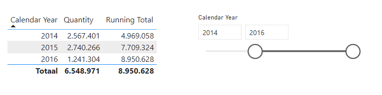
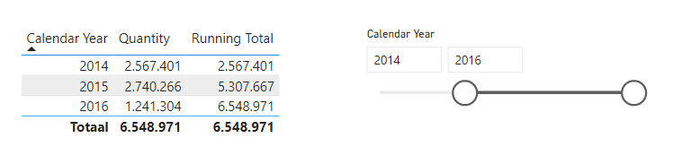
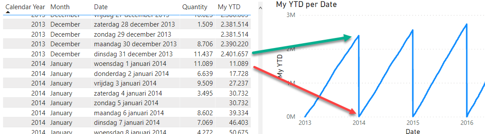
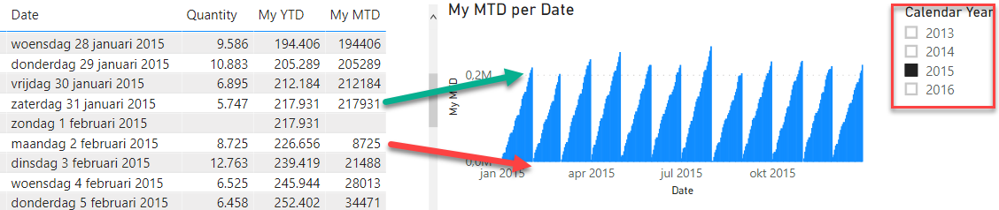
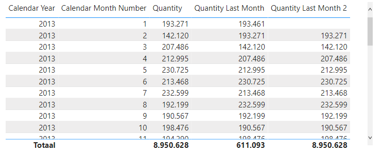

# Lab 2 - filtering

We gaan nog wat meer aan de slag met filteren en contexten. 

## Voorbereiding

Open het bestand '56-filtering-lab2.pbix'. Je ziet hier op **Page 1** het voorbeeld dat we zojuist in de demo behandeld hebben.

De measure `Running Total` is een klein beetje veranderd: er is een `FILTER`-statement toegevoegd. `CALCULATE` *vervangt* namelijk altijd filters op je kolommen - en dat is niet altijd wenselijk. `FILTER` geeft je de mogelijkheid om filters *toe te voegen* aan bestaande filters. Het is een goed gebruik (en zoals je snel zult zien ook broodnodig) om `FILTER` te gebruiken op deze manier.

```dax
Running Total =
VAR HuidigJaar = MAX('Dimension Date'[Date])
VAR RunningTotal = CALCULATE(SUM('Fact Sale'[Quantity]); FILTER(ALL('Dimension Date'); [Date] <= HuidigJaar))
RETURN RunningTotal
```

## Running totals - continued

In de demo die je zojuist gezien hebt werd er een *Running Total* aangemaakt. Deze staat ook op **Page 1** van het Power BI rapport dat je zojuist geopend hebt. Zoals je ziet zijn we er echter nog niet helemaal. Wanneer ik in een slicer namelijk aangeef dat ik alleen de jaren 2014-2016 wil weergeven, zie ik dat de measure *Running Total* ook 2013 meeneemt:



1. Pas de measure **Running Total** aan zodat het Running Total begint bij het eerste weergegeven jaar:



2. Kopieer de definitie van de measure nu naar een `Running Total Zonder Filter`, en verwijder het `FILTER` statement. Zoals je ziet werkt je oplossing nu niet meer
   * Kun je beredeneren wat er plaatsvindt?
   * Bedenk dat `CALCULATE` altijd filters *vervangt*
   * Kun je ook beredeneren waarom de introductie van `FILTER` voor een oplossing zorgt hier?

## Year-to-date

Een *Year-to-date* is in principe hetzelfde als een **Running Total**, maar met één belangrijk verschil: het lopende totaal gaat niet eindeloos terug, maar slechts tot het begin van het jaar.

Schakel naar **Page 2** in het Power BI rapport `56-filtering-lab2`. Je ziet hier een tabel met vier velden:

* Calendar Year
* Month
* Date
* Quantity

3. Maak een nieuwe measure `My YTD`, waarin je een *year-to-date* functionaliteit bouwt
   * Neem als basis de eerder ontwikkelde *running total*
   * Breid deze uit met een `VAR` die je kan vertellen wat het jaar in de huidige context is
   * Breid `VAR RunningTotal` uit zodat de *running total* elk jaar weer bij 0 begint
   * Controleer de uitkomsten in de tabel, en met een lijngrafiek:



4. Maak nu een measure `My MTD`, die een *month-to-date* uitvoert.
   * Mocht de YTD je al makkelijk afgaan, probeer deze dan zonder te spieken bij `RunningTotal`
   * Controleer deze opnieuw met behulp van de tabel en een lijngrafiek. Gebruik daarnaast de reeds aanwezige *slicer* om `[Calendar Year] = 2015` te selecteren.



5. Zou je ook een *running total* over alfabetisch gesorteerde producten kunnen maken? Dus dat je niet zozeer alle eerdere verkopen (in de tijd) bij elkaar optelt, maar alle eerdere producten (in een alfabetische lijst?)

## TOTALYTD

Een eenvoudigere manier om een YTD te berekenen is `TOTALYTD`.

6. Maak een nieuwe measure `My TotalYTD`. Bereken hierin de YTD.
   * Kijk voor een definitie van `TotalYTD` op [https://dax.guide/](https://dax.guide/)

## Measures die een maand eerder kijken

Een andere veelvoorkomende vraag is om periodes met elkaar te kunnen vergelijken. Schakel naar **Page 3**. Hier zie je een tabel met drie kolommen:

* Calendar Year
* Calendar Month Number
* Quantity

7. Maak een nieuwe measure `Quantity Last Month` die de hoeveelheid verkochte producten van één maand terug weergeeft
   * De measure hoeft alleen te werken in deze specifieke tabel
   * Als het lastig is: Probeer in kleine stapjes te werken
     * Je kunt bijvoorbeeld als eerste een measure maken die exact de verkochte hoeveelheden teruggeeft
     * Deze kun je daarna aanpassen dat altijd de verkopen van maart worden teruggegeven
     * Gebruik daarnaast de volgende variabelen als startpunt:
       * `VAR HuidigeDatum = MAX('Dimension Date'[Date])`
       * `VAR HuidigeMaand = MONTH(HuidigeDatum)`
   * Gebruik om de vorige maand te bepalen de functie `EDATE()`
8. Ook deze functie kun je een stuk eenvoudiger oplossen, met `PARALLELPERIOD`. Maak een nieuwe measure `Quantity Last Month 2` die dezelfde functionaliteit heeft als `Quantity Last Month`. Zoek online naar documentatie en/of voorbeelden van `PARALLELPERIOD` om dit voor elkaar te krijgen.


