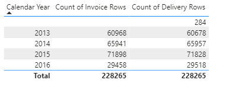
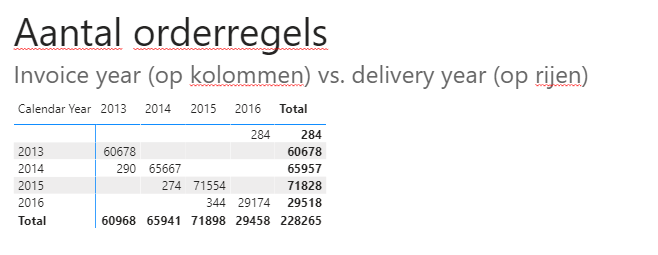
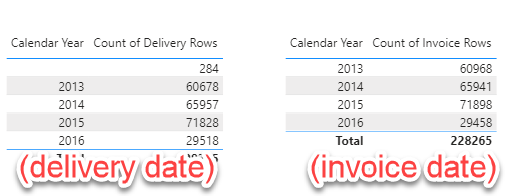
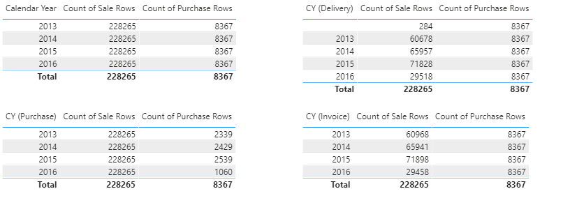
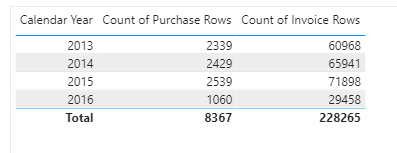
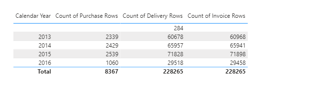

# Minilab - Inactive relationships, sort by column, automatic date table

## Inactive relationships

In Power BI, it is possible to have multiple relationships between two tables, such as a Date dimension table.

1. Create a new measure called `Count of Invoice Rows` that counts the number of rows in the `Sale` table.
1. Visualize this measure using the `Date[Calendar Year]` column.
   * Which relationship is being used by DAX in the background?
1. Create a second measure called `Count of Delivery Rows`. This measure should also count the number of rows in the `Sale` table, but this time using the relationship from the `Date[Date]` column to the `Sale[Delivery Date Key]` column.
   * You can use the `USERELATIONSHIP` function to achieve this.
   * Documentation and examples for using `USERELATIONSHIP` can be found online. :)

## Alternative: Multiple date tables

Using multiple relationships has the disadvantage that within a measure, you need to specify which relationship to use. Additionally, it is not possible to, for example, compare the *invoice date* with the *delivery date* in a matrix, like shown below:

An alternative approach is to load the date table multiple times. Instead of having one `Date` table, you would have separate tables like `Delivery Date` and `Invoice Date`.

4. Create a new calculated table called `Delivery Date`. This table should have the same content as the original `Date` table.
1. Do the same for a new table called `Invoice Date`.
1. Create relationships between the `Sale` table and the new date tables.
1. Remove the relationships between the `Date` table and the `Sale` table.
1. Create a new measure called `Count of Sale Rows`.
1. Verify if the results are the same as when using the `USERELATIONSHIP` approach.

10. Now create the matrix with *invoice year* vs. *delivery year* as shown below:

Splitting the date dimensions into separate tables allows for comparing multiple date lines.

One disadvantage of this approach is that not everything can be linked to an *Order* or *Invoice* date. If a new table with purchases is added, there will be a purchase date that cannot be linked to the existing date tables.

Of course, it is possible to create a separate date table for purchases. However, it becomes challenging to display both sales and purchases for a year over time in a single view.

11. Add data about purchases to your data model. It can be found in the `csv` folder, in the file `Fact.Purchase.csv`.
1. As you can see, the `Purchase` table only has one date column.
1. Create a new date table called `Purchase Date`. This table can have the same content as the `Date` table.
1. Create a relationship between the `Purchase` table and the `Purchase Date` table.
1. Create a measure called `Count of Purchase rows`.
1. Now try splitting the `Count of Purchase rows` and `Count of Sale Rows` over the `Calendar Year` in a single table. Experiment with using the different date tables and observe the results.

To partially overcome this issue, all tables can be linked to the original `Date` table using relationships.

17. Add new relationships between the new tables (`Invoice Date`, `Delivery Date`, `Purchase Date`) and the `Date` table.
1. As you can see, only one of the relationships will be marked as **active**. Make sure that this is the `Invoice Date` relationship.
1. Change the relationships from `1:1` to `1:n` (where `Date` is the `1` side) and choose a one-directional filter.
1. Verify the functionality with a new table where you plot `'Date'[Calendar Year]` against:
   * `Count of Invoice Rows`
   * `Count of Purchase Rows`  
   
1. Adjust the `Count of Delivery Rows` measure to make it work correctly again and add it to the table as well.

As you can see, with some effort, it is possible to add more functions to the date tables. However, in practice, this is not often applied as the model becomes less comprehensible with five date tables...

> ### 1:n
> 
> Strictly speaking, adjusting the `1:1` relationship just now was not necessary for the data model because the date is unique on both sides of the relationship. However, when there is a `1:1` relationship, the `USERELATIONSHIP` function does not work exactly as expected. If you had not adjusted the relationship, you would not have been able to complete the last step (adjusting `Count of Delivery Rows`).