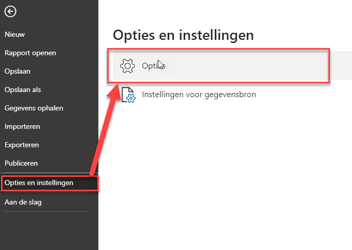
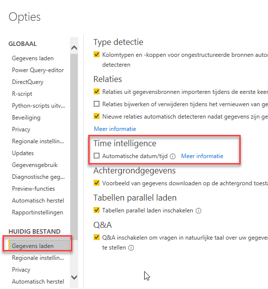
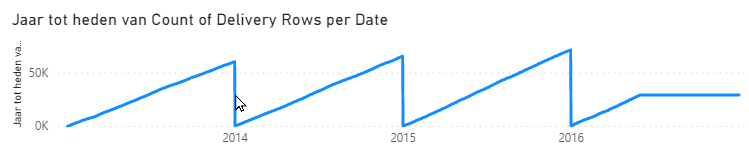

# Automatic date tables, quick measures en datumtabellen binnen DAX

## Automatische date tables

Wanneer je nieuwe data inlaadt in Power BI, kan Power BI "hidden date tables" voor je aanmaken voor elke datumkolom die niet in een relatie gebruikt wordt. Het doel is om altijd de mogelijkheid te hebben om *time intelligence* functies als `PARALLELPERIOD` en `SAMEPERIODLASTYEAR1` toe te kunnen passen. Ook krijg je van Power BI onder elk datumveld een hiërarchie.

Je kunt deze instelling voor het huidige bestand aan- of uitzetten onder **Bestand**, **Opties en Instellingen**, **Opties**. Kies vervolgens voor **Huidig Bestand** -> **Gegevens laden** -> **Automatische datum/tijd**

Over het algemeen is het ideaal om deze tabellen paraat te hebben wanneer je wat snelle analyses wilt doen, heeft het zo zijn beperkingen.

* De datamodellen kunnen vrij snel omvangrijk worden, ook voor kleine datasets. Dat kan lastig zijn wanneer je een snelle analyse per mail met een collega wilt delen. Hier heb ik een tijdje geleden een blog over gedeeld: [Here is why the size of small Power BI models is tens of MBs](https://www.bitrainer.nl/2020/03/06/size-of-small-power-bi-models-is-tens-of-mbs/)
* Het geeft je geen mogelijkheden om meerdere datumvelden in één analyse te combineren. [Alberto Ferrari heeft hier een artikel over geschreven "DAX 101: Automatic Time Intelligence in Power BI"](https://www.sqlbi.com/articles/automatic-time-intelligence-in-power-bi/).

## Quick Measures

Veel **quick measures** bieden handige functies aan om datum/tijd analyses te doen. Ze kunnen dit echter alleen op de automatisch gegenereerde *date tables*, of datumtabellen die binnen het DAX datamodel zijn aangewezen als zodanig.

1. Probeer een nieuwe **quick measure** (*snelle meting*) te maken voor een *Year-to-Date / Totaal van jaar tot heden*. Neem de volgende waarden:
    * Basiswaarde / base value: `Count of Delivery Rows`
    * Datum / Date: `'Delivery Date'[Date]`

Je krijgt nu de melding dat alleen door Power BI gegenereerde datumvelden *of primaire datumkolommen* worden ondersteund. Je kunt dit oplossen door de tabellen aan te merken als datumtabel. Volg daarvoor de volgende stappen:

2. Selecteer de tabel **Date**
1. Op de ribbon wordt nu het tabblad **Tabelhulpmiddelen** zichtbaar.
1. Selecteer hier **Als datumtabel markeren**
1. In het dialoogvenster wat volgt, selecteer je e `[Date]` kolom als zijnde de kolom met datums
1. Herhaal deze stappen voor de andere datumtabellen in je model (`Delivery Date` en `Invoice Date`)

1. Maak nu de **quick measure** zoals je in stap 2 probeerde te doen. Zorg ervoor dat deze in de tabel `Sale` terecht komt.
    * Controleer de werking met een lijngrafiek waarin je de nieuwe measure uitzet tegen `'Delivery Date'[Date]`

> Voor veel *time inelligence* functies moet DAX een datumtabel hebben. Dit is een tabel met een kolom van het type *Date*, waarbij er van de vroegste tot aan de laatste datum in die tabel exact één rij per dag bestaat. Door die verzekering kunnen allerlei "slimmigheden" als parallelle periodes, year-to-date (quarter-to-date, month-to-date) eenvoudig worden geïmplementeerd.
>
> De datumtabellen die Power BI zelf genereert zijn altijd gemarkeerd als *date table*

## Eigen datumtabellen

Wanneer je data uit een Data Warehouse haalt, heb je meestal uitgebreide datum-dimensies tot je beschikking. Allerhande datumvelden die voor jouw organisatie relevant zijn zitten hier al in. Denk aan zaken als:

* 4 weekse periodesystemen
* Weeknummering volgens de ISO-methode
* Boekjaren afwijkend van kalenderjaren
* etc.

Het komt echter ook vaak voor dat je zelf "even" een datumtabel nodig hebt gedurende een ad-hoc analyse in Power BI. Wanneer je zelf een datumtabel wilt aanmaken, dan kan dat eenvoudig met functies als

* `CALENDAR( <eerstedatum> , <laatstedatum> )`
* `CALENDARAUTO()`

Met name `CALENDARAUTO` is erg interessant: deze kijkt in heel je datamodel naar datums, en maakt op basis van de eerste en laatste datum in je model een datumtabel. Daarbij wordt afgerond op hele jaren: de begindatum is altijd 1 januari, de einddatum altijd 31 december.

8. Maak een nieuwe datumtabel met behulp van `CALENDARAUTO`. Noem de tabel `Datums`
1. Voeg aan deze tabel de volgende kolommen toe:
    * Maandnummer
    * Maand kort (gebruik hier de definitie `FORMAT([Date]; "mmm")`)
1. Maak nu een visualisatie waarin je de `'Datums'[Maand kort]` uitzet tegen `[Count of Invoice Rows]`
    * Maak de benodigde aanpassingen in het datamodel zodat de aantallen ook kloppen
    * Maak de benodigde aanpassingen in de `'Datums'` tabel om ervoor te zorgen dat de kolom `[Maand kort]` correct gesorteerd wordt. [Mocht je er niet uitkomen, dan staat hier een tip over hoe dit op te lossen](https://radacad.com/sort-by-column-in-power-bi)
1. Breid de datumtabel uit met nog enkele nieuwe calculated columns. Bekijk de documentatie op [https://docs.microsoft.com/en-us/dax/format-function-dax](https://docs.microsoft.com/en-us/dax/format-function-dax). Onder het kopje ["See Also"](https://docs.microsoft.com/en-us/dax/format-function-dax#see-also) vind je meer pagina's met informatie voor de zogenaamde "format strings" (zoals bijvoorbeeld de `mmm` die zojuist de verkorte maand opleverde). Je kunt hier denken aan:
    * Jaar + korte maand ("2018 jan")
    * Volledige maand ("Januari")
    * Een uitgeschreven datum ("Woensdag 12 maart 2008" of "Wednesday, March 12, 2008"). Let op: je hoeft hier geen codes als "yyyy" en "mmm" te gebruiken!
    * Jaar-maand-dag notatie ("2018-02-01")
1. Maak een visualisatie waarin je `'Datums'[Jaar + korte maand]` uitzet tegen de YTD-functie die je eerder met een *quick measure* hebt gemaakt (in een Nederlandstalige Power BI heet deze `[Jaar tot heden van Count of Delivery Rows]` ). 
    * Zorg dat ook de notatie "2018 jan" correct sorteert. 
    * Wanneer je nog geen goede kolom hebt om te gebruiken voor de sortering, voeg dan een kolom toe om de sortering correct te krijgen.
1. *Dit is een bonus-opgave*. Maak een kolom met een jaar-maand combinatie ("201812"). De kolom moet numeriek zijn. Maak geen gebruik van de `FORMAT`-functie. Gebruik ook geen andere kolommen, naast de `[Date]` kolom.

## Bonus: eigen tabellen genereren met DAX

We hebben zojuist met `CALENDARAUTO` een tabel gegenereerd en hier vervolgens diverse kolommen handmatig aan toegevoegd. Je kunt het aanmaken én uitbreiden van een tabel echter ook in één DAX statement doen - met behulp van de functie `ADDCOLUMNS`.

14. *Dit is een bonus-opgave*. Maak een nieuwe *calculated table* met de naam `Datums-AddColumns`. Deze moet de eerste drie kolommen van de `datums`-tabel bevatten met behulp van een enkele `ADDCOLUMNS` functie. Je mag niet verwijzen naar de `Datums`-tabel :-).
    * Zoek de documentatie van `ADDCOLUMNS` op op [dax.guide](https://dax.guide)
    * Het eerste argument (de `<table>` is `CALENDARAUTO()`)
    * Probeer zelf de volgende argumenten uit te vinden
